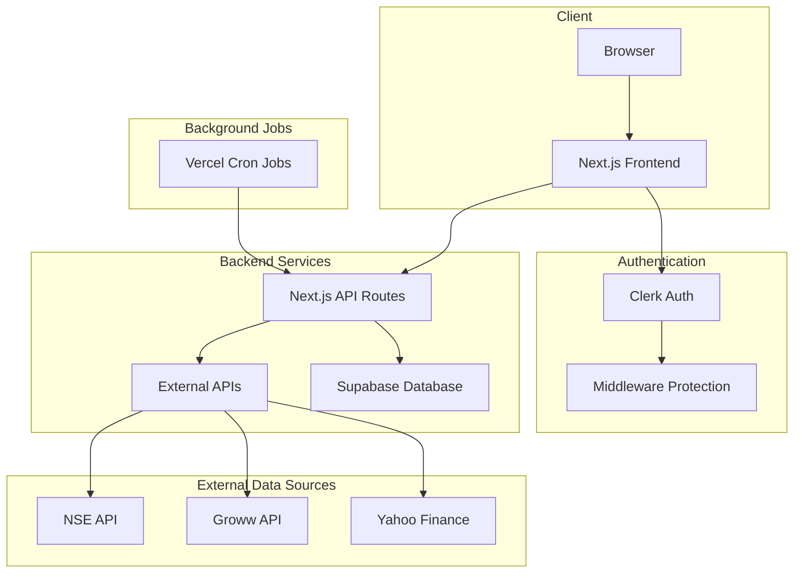
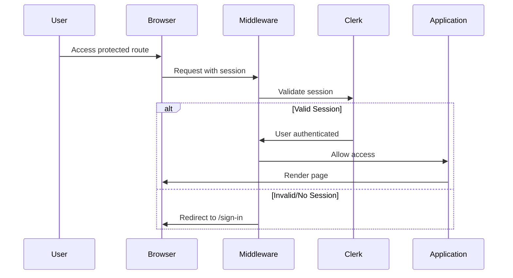
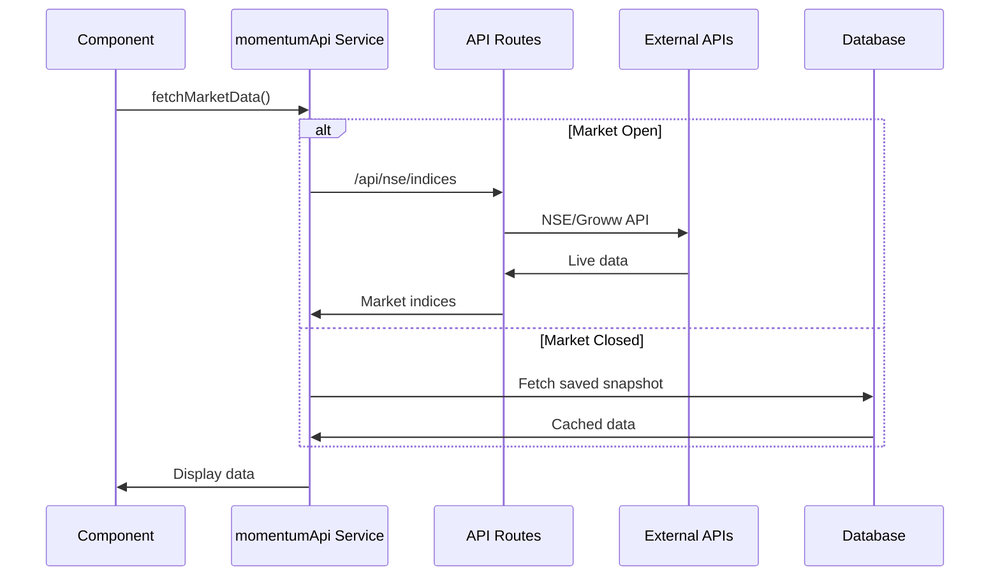

# Trading Web Application - Production Explanation Document

**Application Name:** ectrade  
**Application Type:** Web Application (Trading Analytics Platform)  
**Tech Stack:** Next.js 14 (Frontend), Supabase (Database), Clerk (Authentication)  
**Environment:** Production-Grade System  
**Date Generated:** January 30, 2026

---

## Table of Contents

1. [Application Architecture Overview](#1-application-architecture-overview)
2. [Authentication & Authorization Flow](#2-authentication--authorization-flow)
3. [Role-Based Access Control (RBAC)](#3-role-based-access-control-rbac)
4. [API & Database Design Summary](#4-api--database-design-summary)
5. [Environment Variables & Secrets Management](#5-environment-variables--secrets-management)
6. [Deployment & CI/CD Overview](#6-deployment--cicd-overview)
7. [Error Handling Strategy](#7-error-handling-strategy)
8. [Performance Optimization Strategy](#8-performance-optimization-strategy)
9. [Security Best Practices](#9-security-best-practices)
10. [Page Documentation](#10-page-documentation)

---

## 1. Application Architecture Overview

### High-Level Architecture



### Technology Stack

| Layer | Technology | Purpose |
|-------|------------|---------|
| Frontend | Next.js 14 (App Router) | React-based SSR/CSR framework |
| Styling | TailwindCSS | Utility-first CSS framework |
| Authentication | Clerk | User authentication & session management |
| Database | Supabase (PostgreSQL) | Data persistence with RLS policies |
| Hosting | Vercel | Serverless deployment with edge functions |
| Charts | Recharts | Interactive data visualization |
| External APIs | NSE, Groww, Yahoo Finance | Market data sources |

### Core Application Modules

1. **Momentum Dashboard** - Real-time market indices, top gainers/losers, sector performance
2. **Option Chain Analysis** - NIFTY/BANKNIFTY/FINNIFTY open interest visualization
3. **Breakout Stocks** - Stocks breaking previous day high/low levels
4. **Sector Performance** - Comparative sector analysis
5. **Time-Travel Replay** - Historical data playback system

### Directory Structure

```
trading-web2-main/
├── app/                    # Next.js App Router pages
│   ├── api/               # API routes
│   │   └── cron/          # Cron job endpoints
│   ├── momentum/          # Momentum dashboard page
│   ├── option-chain/      # Option chain analysis page
│   ├── breakout-stocks/   # Breakout stocks page
│   └── ...               # Other pages
├── components/            # React components
│   └── momentum/          # Momentum-specific components
├── services/              # Business logic services
├── constants/             # Static configuration
├── lib/                   # Utility libraries (Supabase client)
├── supabase/              # Database schemas
└── vercel.json            # Cron job configuration
```

---

## 2. Authentication & Authorization Flow

### Authentication Provider

The application uses **Clerk** for authentication, providing:
- Email/password authentication
- Social logins (if configured)
- Session management
- User profile management

### Authentication Flow



### Middleware Configuration

The middleware ([middleware.ts](file:///Users/santosh/Downloads/trading-web2-main/middleware.ts)) defines route protection:

**Public Routes (No Authentication Required):**
- `/` - Homepage (landing page)
- `/contact-us` - Contact page
- `/about-us` - About Us page
- `/faq` - FAQ page
- `/disclaimers` - Disclaimers
- `/risk-disclosure` - Risk disclosure
- `/terms-conditions` - Terms & Conditions
- `/privacy-policy` - Privacy policy
- `/sign-in`, `/sign-up` - Authentication pages
- `/api/*` - All API routes (for cron jobs, webhooks)

**Protected Routes (Authentication Required):**
- `/momentum` - Momentum dashboard
- `/option-chain` - Option chain analysis
- `/breakout-stocks` - Breakout stocks scanner
- `/sector-performance` - Sector performance
- `/stock-dashboard` - Stock dashboard
- `/chart/*` - Individual stock charts

### Automatic Redirect Behavior

- **Authenticated users on `/`**: Automatically redirected to `/momentum`
- **Unauthenticated users on protected routes**: Redirected to `/sign-in`

---

## 3. Role-Based Access Control (RBAC)

### Current Implementation

The application currently implements a **binary access model**:
- **Authenticated Users**: Full access to all protected features
- **Unauthenticated Users**: Access only to public/marketing pages

### Access Matrix

| Page | Unauthenticated | Authenticated |
|------|-----------------|---------------|
| Landing Page (`/`) | ✅ | ➡️ Redirect to /momentum |
| Momentum Dashboard | ❌ | ✅ |
| Option Chain | ❌ | ✅ |
| Breakout Stocks | ❌ | ✅ |
| Sector Performance | ❌ | ✅ |
| Stock Dashboard | ❌ | ✅ |
| Contact/About/FAQ | ✅ | ✅ |
| Legal Pages | ✅ | ✅ |

### Future RBAC Considerations

For premium features, consider implementing:
- **Free Tier**: Basic access with delayed data
- **Premium Tier**: Real-time data, advanced analytics
- **Admin Role**: Data management, user administration

---

## 4. API & Database Design Summary

### API Routes Architecture

| Category | Route Pattern | Purpose |
|----------|--------------|---------|
| Market Data | `/api/market-indices` | Market indices data |
| Sectors | `/api/sector-stocks` | Sector-wise stock data |
| Option Chain | `/api/option-chain/*` | Options data from NSE |
| Breakouts | `/api/breakouts` | Breakout/breakdown stocks |
| Historical | `/api/snapshots` | Time-travel data |
| Cron Jobs | `/api/cron/*` | Background data collection |

### Database Schema Overview

```mermaid
erDiagram
    stock_snapshots {
        uuid id PK
        timestamp captured_at
        varchar symbol
        varchar sector
        decimal ltp
        decimal open_price
        decimal close_price
        decimal change_percent
    }
    
    sector_snapshots {
        uuid id PK
        timestamp captured_at
        varchar sector_name
        decimal last_price
        decimal change_percent
    }
    
    option_chain_snapshots {
        uuid id PK
        timestamp captured_at
        varchar symbol
        varchar expiry_date
        decimal nifty_spot
        jsonb option_chain_data
    }
    
    daily_high_low {
        uuid id PK
        varchar symbol
        varchar sector
        decimal today_high
        decimal today_low
        decimal today_open
        decimal today_close
        date captured_date
    }
    
    breakout_snapshots {
        bigint id PK
        text symbol
        decimal current_price
        decimal prev_day_high
        decimal prev_day_low
        boolean is_breakout
        boolean is_breakdown
    }
    
    pcr_data {
        uuid id PK
        varchar index_name
        bigint total_put_oi
        bigint total_call_oi
        decimal pcr_value
        varchar sentiment
        timestamp captured_at
    }
    
    oi_trendline {
        uuid id PK
        timestamp captured_at
        varchar symbol
        varchar expiry_date
        bigint total_put_oi
        bigint total_call_oi
        decimal pcr
    }
    
    market_indices_snapshots {
        uuid id PK
        varchar index_name
        decimal value
        decimal change
        decimal change_percent
        timestamp captured_at
    }
    
    api_tokens {
        int idx PK
        varchar id
        text token
        timestamp updated_at
    }
```



### Key Database Tables

| Table | Purpose | Update Frequency |
|-------|---------|------------------|
| `stock_snapshots` | Pre-calculated stock data for top movers | Every 3 minutes |
| `sector_snapshots` | Historical sector performance | Every 1 minute |
| `option_chain_snapshots` | Historical option chain data | Every 3 minutes |
| `daily_high_low` | Previous day OHLC for breakout detection | Daily at 5:30 PM IST |
| `breakout_snapshots` | Real-time breakout/breakdown stocks | Every 1 minute |
| `pcr_data` | Put-Call Ratio calculations | Every 1 minute |
| `oi_trendline` | OI trend data for charting | Every 3 minutes |
| `market_indices_snapshots` | Saved market indices after market close | End of day |
| `api_tokens` | Groww API token storage | Refreshed periodically |

### Row-Level Security (RLS)

All tables implement RLS policies:
- **Public Read Access**: All authenticated/anonymous users can read data
- **Service Role Insert/Update**: Only the service role (cron jobs) can modify data

---

## 5. Environment Variables & Secrets Management

### Required Environment Variables

| Variable | Purpose | Classification |
|----------|---------|----------------|
| `NEXT_PUBLIC_CLERK_PUBLISHABLE_KEY` | Clerk public key | Public |
| `CLERK_SECRET_KEY` | Clerk secret key | **Secret** |
| `NEXT_PUBLIC_CLERK_SIGN_IN_URL` | Sign-in page URL | Public |
| `NEXT_PUBLIC_CLERK_SIGN_UP_URL` | Sign-up page URL | Public |
| `NEXT_PUBLIC_SUPABASE_URL` | Supabase project URL | Public |
| `NEXT_PUBLIC_SUPABASE_ANON_KEY` | Supabase anonymous key | Public |
| `SUPABASE_SERVICE_ROLE_KEY` | Supabase service role key | **Secret** |
| `CRON_SECRET` | Secret for cron job authentication | **Secret** |
| `GROWW_ACCESS_TOKEN` | Groww API access token | **Secret** |

### Secret Management Best Practices

> [!CAUTION]
> Never commit `.env.local` or any file containing secrets to version control.

1. **Local Development**: Use `.env.local` file (gitignored)
2. **Production**: Configure through Vercel's Environment Variables UI
3. **Rotation**: Regularly rotate API tokens and secrets
4. **Access Control**: Limit access to production environment variables

---

## 6. Deployment & CI/CD Overview

### Deployment Platform

The application is deployed on **Vercel** with the following configuration:

### Cron Jobs Configuration

Cron jobs are configured in [vercel.json](file:///Users/santosh/Downloads/trading-web2-main/vercel.json):

| Job | Schedule (UTC) | Purpose |
|-----|----------------|---------|
| `refresh-groww-token` | 2:30 AM Mon-Fri | Refresh Groww API token |
| `cleanup-intraday` | 3:30 AM Mon-Fri | Clean up intraday data |
| `populate-daily-high-low` | 5:00 PM Mon-Fri | Store previous day OHLC |
| `populate-morning-open` | 3:46 AM Mon-Fri | Capture morning open prices |
| `capture-market-data` | Every 1 min, 3-10 AM UTC | Capture market snapshots |
| `option-chain-cron` | Every 3 min, 3-10 AM UTC | Store option chain data |
| `check-breakouts` | Every 1 min, 3-10 AM UTC | Detect breakouts/breakdowns |
| `calculate-pcr` | Every 1 min, 3-10 AM UTC | Calculate PCR values |
| `update-stock-snapshots` | Every 3 min, 3-10 AM UTC | Update stock snapshots |

> [!NOTE]
> Market hours in IST (9:15 AM - 3:30 PM) correspond to UTC 3:45 AM - 10:00 AM.

### Deployment Process

1. **Push to Main Branch**: Triggers automatic deployment
2. **Preview Deployments**: Created for pull requests
3. **Production Deployment**: Automatic on merge to main

### Function Configuration

```json
{
  "functions": {
    "app/api/cron/**/*.ts": {
      "maxDuration": 300
    }
  }
}
```

Cron jobs have a 5-minute (300 seconds) maximum execution time.

---

## 7. Error Handling Strategy

### Frontend Error Handling

1. **Loading States**: All data-fetching components show loading spinners
2. **Error Boundaries**: React error boundaries catch rendering errors
3. **Graceful Degradation**: Show fallback UI when data unavailable
4. **Retry Logic**: Auto-refresh mechanisms for transient failures

### API Error Handling

1. **Try-Catch Blocks**: All API routes wrapped in try-catch
2. **Structured Responses**: Consistent error response format
3. **Logging**: Console logging for debugging (consider external logging service)
4. **HTTP Status Codes**: Appropriate status codes returned

### Error Response Format

```json
{
  "success": false,
  "error": "Error message description",
  "code": "ERROR_CODE"
}
```

### External API Fallbacks

The application implements fallback chains for data sources:

1. **Market Indices**: NSE API → Groww API → Database Snapshot
2. **Option Chain**: NSE Primary API → NSE Legacy API → Calculated Expiry
3. **Stock Data**: Groww LTP API → OHLC API → Historical Data

---

## 8. Performance Optimization Strategy

### Data Caching Strategy

| Data Type | Cache Strategy | Duration |
|-----------|----------------|----------|
| Market Indices | In-memory + localStorage | 5 seconds |
| Stock Snapshots | Database pre-calculated | 3 minutes |
| Option Chain | API + Historical DB | 3 minutes |
| Sector Data | API fresh + Historical | 1 minute |

### Frontend Optimizations

1. **Code Splitting**: Automatic route-based splitting via Next.js
2. **Image Optimization**: Next.js Image component
3. **Lazy Loading**: Components loaded on demand
4. **Memoization**: React.memo and useMemo for expensive computations
5. **Debouncing**: User input debounced for API calls

### Database Optimizations

1. **Indexes**: Strategic indexes on frequently queried columns
2. **Composite Keys**: Unique constraints prevent duplicate data
3. **Data Retention**: Automatic cleanup of old data (90 days)
4. **Connection Pooling**: Supabase handles connection management

### API Optimizations

1. **Pre-calculated Data**: Stock snapshots computed by cron jobs
2. **Batched Requests**: Multiple symbols fetched in single API call
3. **Cache Headers**: Appropriate cache-control headers

---

## 9. Security Best Practices

### Authentication Security

- ✅ Clerk handles password hashing and session management
- ✅ CSRF protection built into Next.js
- ✅ Secure session cookies with HttpOnly flag

### API Security

- ✅ All protected routes require authentication
- ✅ API routes accessible for cron jobs (consider adding secret verification)
- ✅ Row-Level Security on all database tables

### Data Security

- ✅ Environment variables for secrets
- ✅ Supabase RLS policies restrict data access
- ✅ No sensitive data exposed in client-side code

### Recommended Improvements

> [!IMPORTANT]
> Consider implementing these additional security measures:

1. **Rate Limiting**: Add rate limiting to API routes
2. **Cron Secret Verification**: Verify `CRON_SECRET` header in cron jobs
3. **Input Validation**: Add Zod or similar for input validation
4. **Content Security Policy**: Implement CSP headers
5. **API Key Rotation**: Automated rotation for external API keys

---

## 10. Page Documentation

---

### 10.1 Landing Page (`/`)

#### Page Overview

| Property | Value |
|----------|-------|
| **Route/URL** | `/` |
| **File Location** | `app/page.tsx` |
| **Access** | Public (authenticated users redirected to /momentum) |

#### Purpose

Marketing landing page that introduces the ectrade platform to new users. Showcases key features, testimonials, and call-to-action for sign-up.

#### Key Features & Functionalities

- Hero section with value proposition
- Feature exploration section
- Partner logos display
- Customer testimonials carousel
- Newsletter subscription form
- Responsive navigation header
- Automatic redirect for authenticated users

#### UI Components Used

| Component | Purpose |
|-----------|---------|
| `Header` | Navigation and branding |
| `Hero` | Main value proposition |
| `Partners` | Partner logo display |
| `Explore` | Feature showcase |
| `Testimonials` | Customer testimonials |
| `Subscribe` | Newsletter subscription |
| `Footer` | Site navigation and links |

#### Data Flow

1. Check authentication status via Clerk's `useAuth`
2. If authenticated → redirect to `/momentum`
3. If not authenticated → render landing page components

#### API Calls

| Endpoint | Method | Purpose |
|----------|--------|---------|
| None | - | Static page, no API calls |

#### Validations & Error Handling

- Loading state while Clerk initializes
- Graceful handling of authentication check

#### Edge Cases

- Slow Clerk initialization: Shows loading spinner
- Authentication check failure: Renders landing page

#### SEO / Metadata

```typescript
{
  title: "India's Best Toolkit for Trading",
  description: 'Work with all the necessary information and tools...',
  keywords: 'trading, investment, stock market, India, finance'
}
```

---

### 10.2 Momentum Dashboard (`/momentum`)

#### Page Overview

| Property | Value |
|----------|-------|
| **Route/URL** | `/momentum` |
| **File Location** | `app/momentum/page.tsx` |
| **Access** | Authenticated Users Only |

#### Purpose

Primary trading dashboard displaying real-time market indices, sector performance, top gainers/losers, and market momentum indicators.

#### Key Features & Functionalities

- **Market Indices Display**: NIFTY 50, NIFTY BANK, SENSEX, FINNIFTY, INDIA VIX
- **Top Movers**: Real-time top gainers and losers
- **Sector Performance**: All major sector indices
- **Time-Travel Replay**: Historical data playback
- **Disclaimer Modal**: Daily disclaimer acceptance
- **Video Tutorial**: Educational content

#### UI Components Used

| Component | Purpose |
|-----------|---------|
| `TopNavigation` | Market indices, navigation, top movers |
| `DisclaimerModal` | Daily disclaimer acceptance |
| `VideoTutorial` | Educational video section |
| `Footer` | Site navigation |
| `TopGainersList` | Top gaining stocks |
| `TopLosersList` | Top losing stocks |

#### Data Flow



#### API Calls

| Endpoint | Method | Purpose |
|----------|--------|---------|
| `/api/nse/indices` | GET | Fetch market indices from NSE |
| `/api/groww/ltp` | GET | Backup LTP data from Groww |
| `/api/groww/ohlc` | GET | OHLC data for change calculation |
| `/api/market-indices` | GET | Database snapshot (after hours) |
| `/api/top-movers` | GET | Top gainers/losers |

#### Database Tables Involved

| Table | Purpose |
|-------|---------|
| `stock_snapshots` | Pre-calculated top movers |
| `market_indices_snapshots` | Saved end-of-day indices |
| `sector_snapshots` | Historical sector data |

#### Validations & Error Handling

- Fallback to database when NSE API fails
- Default values for missing index data
- Error handling for Groww API failures

#### Edge Cases

| Scenario | Handling |
|----------|----------|
| API timeout | Fallback to previous data |
| Weekend access | Show Friday's closing data |
| API rate limiting | Backoff and retry |

#### Performance Considerations

- 5-second refresh interval during market hours
- Accordion state persistence in localStorage
- Lazy loading of sector stocks

---

### 10.3 Option Chain Analysis (`/option-chain`)

#### Page Overview

| Property | Value |
|----------|-------|
| **Route/URL** | `/option-chain` |
| **File Location** | `app/option-chain/page.tsx` |
| **Access** | Authenticated Users Only |

#### Purpose

Visual analysis of NIFTY, BANKNIFTY, and FINNIFTY option chains with open interest data, PCR calculation, and max pain identification.

#### Key Features & Functionalities

- **Instrument Selection**: NIFTY 50, BANKNIFTY, FINNIFTY
- **Expiry Date Selection**: Multiple expiry dates
- **Open Interest Charts**: Bar charts for Call/Put OI
- **OI Change Charts**: Visualization of OI changes
- **PCR Calculation**: Put-Call Ratio with sentiment
- **Max Pain Calculation**: Price point with minimum pain
- **PCR Trendline**: Historical PCR chart
- **Time-Travel Replay**: Historical option chain data
- **Multiple Chart Layouts**: 1x1, 2x2, 1x4, 4x4

#### UI Components Used

| Component | Purpose |
|-----------|---------|
| `TopNavigation` | Market indices (top movers hidden) |
| `TimelineSlider` | Time-travel selection |
| `Recharts Components` | Bar charts, line charts |
| `VideoTutorial` | Educational content |
| `Footer` | Site navigation |

#### Data Flow

```mermaid
flowchart TD
    A[Page Load] --> B{Replay Mode?}
    B -->|No| C[Fetch Live Data]
    B -->|Yes| D[Fetch Historical Data]
    C --> E[/api/option-chain]
    D --> F[/api/option-chain/save]
    E --> G[NSE API]
    F --> H[Database]
    G --> I[Process Option Chain]
    H --> I
    I --> J[Calculate PCR]
    I --> K[Calculate Max Pain]
    I --> L[Filter Strikes ±500]
    J --> M[Update Charts]
    K --> M
    L --> M
```

#### API Calls

| Endpoint | Method | Purpose |
|----------|--------|---------|
| `/api/option-chain` | GET | Live option chain from NSE |
| `/api/option-chain/expiries` | GET | Available expiry dates |
| `/api/option-chain/save` | GET | Historical option chain data |
| `/api/pcr-trendline` | GET | PCR history for trendline |

#### Database Tables Involved

| Table | Purpose |
|-------|---------|
| `option_chain_snapshots` | Historical option chain data |
| `oi_trendline` | PCR and OI trend data |
| `pcr_data` | Calculated PCR values |

#### Validations & Error Handling

- Expiry date format validation (DD-MMM-YYYY)
- Empty data detection
- API timeout handling
- Session establishment with NSE

#### Edge Cases

| Scenario | Handling |
|----------|----------|
| No expiry dates | Fallback to calculated next Thursday |
| Empty option chain | Show "No data" message |
| Time outside market hours | Fetch latest available snapshot |
| NSE blocking requests | Session re-establishment |

#### Performance Considerations

- 5-minute auto-refresh during market hours
- Strike range filtering (±500 from spot)
- PCR history limited to 1000 points
- No refresh after market close

#### Key Calculations

**PCR (Put-Call Ratio)**:
```
PCR = Total Put OI / Total Call OI
```

**Max Pain**:
```
For each strike as expiration price:
  Sum of (Call OI × max(0, expiration - strike))
  + Sum of (Put OI × max(0, strike - expiration))
Max Pain = Strike with minimum total pain
```

---

### 10.4 Breakout Stocks (`/breakout-stocks`)

#### Page Overview

| Property | Value |
|----------|-------|
| **Route/URL** | `/breakout-stocks` |
| **File Location** | `app/breakout-stocks/page.tsx` |
| **Access** | Authenticated Users Only |

#### Purpose

Real-time scanner for stocks breaking their previous day's high (breakouts) or low (breakdowns), helping traders identify momentum opportunities.

#### Key Features & Functionalities

- **Breakout Detection**: Stocks trading above previous day high
- **Breakdown Detection**: Stocks trading below previous day low
- **Previous Day Sentiment**: Green/Red indicator based on prior day's candle
- **Percentage Calculations**: From open, from breakout level
- **TradingView Integration**: Click to open stock chart
- **Load More Pagination**: Progressive loading of stocks

#### UI Components Used

| Component | Purpose |
|-----------|---------|
| `TopNavigation` | Market indices (top movers hidden) |
| `VideoTutorial` | Educational content |
| `Footer` | Site navigation |

#### Data Flow

```mermaid
flowchart LR
    A[Page Load] --> B[/api/breakouts]
    B --> C[Supabase: breakout_snapshots]
    C --> D[Process Breakouts]
    C --> E[Process Breakdowns]
    D --> F[Sort by % Change]
    E --> G[Sort by % Change]
    F --> H[Display Gainers Table]
    G --> I[Display Losers Table]
```

#### API Calls

| Endpoint | Method | Purpose |
|----------|--------|---------|
| `/api/breakouts` | GET | Fetch breakout and breakdown stocks |

#### Database Tables Involved

| Table | Purpose |
|-------|---------|
| `breakout_snapshots` | Pre-calculated breakout/breakdown data |
| `daily_high_low` | Reference for previous day levels |

#### Table Columns

**Breakout Stocks Table**:
| Column | Description |
|--------|-------------|
| Stock | Symbol with sentiment indicator |
| LTP | Last traded price |
| Close | Previous day close |
| Today Open | Today's opening price |
| From Open | Percentage change from open |
| Yday High | Previous day high |
| From Breakout | Distance from breakout level |

**Breakdown Stocks Table**:
| Column | Description |
|--------|-------------|
| Stock | Symbol with sentiment indicator |
| LTP | Last traded price |
| Close | Previous day close |
| Today Open | Today's opening price |
| From Open | Percentage change from open |
| Yday Low | Previous day low |
| From Breakdown | Distance from breakdown level |

#### Validations & Error Handling

- Loading state during API fetch
- Empty state handling for no breakouts/breakdowns
- Prevent concurrent fetches with ref guard

#### Edge Cases

| Scenario | Handling |
|----------|----------|
| No breakouts today | Display "No breakout stocks found" |
| API error | Show error state |
| Missing previous day data | Fallback calculations |

#### Performance Considerations

- 2-minute auto-refresh interval
- Progressive loading (10 stocks initially)
- Concurrent fetch prevention

---

### 10.5 Sector Performance (`/sector-performance`)

#### Page Overview

| Property | Value |
|----------|-------|
| **Route/URL** | `/sector-performance` |
| **File Location** | `app/sector-performance/page.tsx` |
| **Access** | Authenticated Users Only |

#### Purpose

Comprehensive sector analysis dashboard showing all NSE sectoral indices with performance metrics and constituent stocks.

#### Key Features & Functionalities

- **15 Sector Indices**: Bank Nifty, IT, Auto, Pharma, FMCG, Metal, Realty, Energy, Financial Services, Private Bank, PSU Bank, Consumer Durables, Nifty MidSelect, Oil & Gas, Consumption
- **Sector Metrics**: Last price, change %, week/month/year performance
- **Constituent Stocks**: Expandable section per sector
- **Time-Travel Replay**: Historical sector performance

#### API Calls

| Endpoint | Method | Purpose |
|----------|--------|---------|
| `/api/nse/indices` | GET | Sector indices from NSE |
| `/api/sector-stocks` | GET | Constituent stocks per sector |

#### Database Tables Involved

| Table | Purpose |
|-------|---------|
| `sector_snapshots` | Historical sector data |

---

### 10.6 Stock Dashboard (`/stock-dashboard`)

#### Page Overview

| Property | Value |
|----------|-------|
| **Route/URL** | `/stock-dashboard` |
| **File Location** | `app/stock-dashboard/page.tsx` |
| **Access** | Authenticated Users Only |

#### Purpose

Detailed individual stock analysis with real-time price updates, technical indicators, and historical data.

#### Key Features

- Individual stock analysis
- Price charts
- Technical indicators
- Volume analysis

---

### 10.7 Stock Chart (`/chart/[symbol]`)

#### Page Overview

| Property | Value |
|----------|-------|
| **Route/URL** | `/chart/[symbol]` |
| **File Location** | `app/chart/[symbol]/page.tsx` |
| **Access** | Authenticated Users Only |

#### Purpose

Dynamic route for viewing TradingView charts for individual stocks.

#### Key Features

- TradingView widget integration
- Dynamic symbol routing
- Full-screen chart view

---

### 10.8 Sign In (`/sign-in`)

#### Page Overview

| Property | Value |
|----------|-------|
| **Route/URL** | `/sign-in` |
| **File Location** | `app/sign-in/[[...sign-in]]/page.tsx` |
| **Access** | Public |

#### Purpose

Clerk-managed sign-in page for user authentication.

#### Key Features

- Email/password login
- Social login options (if configured)
- Password recovery
- Remember me functionality

---

### 10.9 Sign Up (`/sign-up`)

#### Page Overview

| Property | Value |
|----------|-------|
| **Route/URL** | `/sign-up` |
| **File Location** | `app/sign-up/[[...sign-up]]/page.tsx` |
| **Access** | Public |

#### Purpose

Clerk-managed sign-up page for new user registration.

#### Key Features

- Email/password registration
- Social sign-up options (if configured)
- Email verification
- Terms acceptance

---

### 10.10 Contact Us (`/contact-us`)

#### Page Overview

| Property | Value |
|----------|-------|
| **Route/URL** | `/contact-us` |
| **File Location** | `app/contact-us/page.tsx` |
| **Access** | Public |

#### Purpose

Company contact information, FAQ, vision, mission, and service details.

#### Sections

- Contact information
- Frequently Asked Questions
- Vision & Mission statements
- About Us
- Why Choose Us
- Service descriptions (Momentum, Options, Breakout)

---

### 10.11 About Us (`/about-us`)

| Property | Value |
|----------|-------|
| **Route/URL** | `/about-us` |
| **Access** | Public |

Company background and team information.

---

### 10.12 FAQ (`/faq`)

| Property | Value |
|----------|-------|
| **Route/URL** | `/faq` |
| **Access** | Public |

Frequently asked questions about the platform.

---

### 10.13 Legal Pages

| Page | Route | Purpose |
|------|-------|---------|
| Disclaimers | `/disclaimers` | Investment disclaimers |
| Disclosures | `/disclosures` | Regulatory disclosures |
| Privacy Policy | `/privacy-policy` | Data handling policies |
| Terms & Conditions | `/terms-conditions` | Usage terms |
| Risk Disclosure | `/risk-disclosure` | Trading risk warnings |
| Refund Policy | `/refund-policy` | Refund terms |

All legal pages are **publicly accessible** and contain static content.

---

## Appendix A: Cron Jobs Detail

### A.1 Refresh Groww Token

| Property | Value |
|----------|-------|
| **Endpoint** | `/api/cron/refresh-groww-token` |
| **Schedule** | 2:30 AM UTC (Mon-Fri) |
| **Purpose** | Refresh Groww API access token |
| **Database** | Updates `api_tokens` table |

### A.2 Cleanup Intraday

| Property | Value |
|----------|-------|
| **Endpoint** | `/api/cron/cleanup-intraday` |
| **Schedule** | 3:30 AM UTC (Mon-Fri) |
| **Purpose** | Clean up old intraday data |
| **Database** | Deletes old snapshots (>90 days) |

### A.3 Populate Daily High-Low

| Property | Value |
|----------|-------|
| **Endpoint** | `/api/cron/populate-daily-high-low` |
| **Schedule** | 5:00 PM UTC (Mon-Fri) = 10:30 PM IST |
| **Purpose** | Store previous day OHLC for all tracked stocks |
| **Database** | Clears and repopulates `daily_high_low` |
| **Data Source** | Yahoo Finance |

### A.4 Populate Morning Open

| Property | Value |
|----------|-------|
| **Endpoint** | `/api/cron/populate-morning-open` |
| **Schedule** | 3:46 AM UTC (Mon-Fri) = 9:16 AM IST |
| **Purpose** | Capture today's opening prices |
| **Database** | Updates `daily_high_low.today_open` |
| **Data Source** | Groww API |

### A.5 Capture Market Data

| Property | Value |
|----------|-------|
| **Endpoint** | `/api/cron/capture-market-data` |
| **Schedule** | Every 1 minute, 3-10 AM UTC (Mon-Fri) |
| **Purpose** | Capture market indices and sector data |
| **Database** | `sector_snapshots`, `market_indices_snapshots` |

### A.6 Option Chain Cron

| Property | Value |
|----------|-------|
| **Endpoint** | `/api/cron/option-chain-cron` |
| **Schedule** | Every 3 minutes, 3-10 AM UTC (Mon-Fri) |
| **Purpose** | Store option chain snapshots |
| **Database** | `option_chain_snapshots`, `oi_trendline` |

### A.7 Check Breakouts

| Property | Value |
|----------|-------|
| **Endpoint** | `/api/cron/check-breakouts` |
| **Schedule** | Every 1 minute, 3-10 AM UTC (Mon-Fri) |
| **Purpose** | Detect stocks breaking previous day high/low |
| **Database** | Updates `breakout_snapshots` |

### A.8 Calculate PCR

| Property | Value |
|----------|-------|
| **Endpoint** | `/api/cron/calculate-pcr` |
| **Schedule** | Every 1 minute, 3-10 AM UTC (Mon-Fri) |
| **Purpose** | Calculate Put-Call Ratio for indices |
| **Database** | `pcr_data` |

### A.9 Update Stock Snapshots

| Property | Value |
|----------|-------|
| **Endpoint** | `/api/cron/update-stock-snapshots` |
| **Schedule** | Every 3 minutes, 3-10 AM UTC (Mon-Fri) |
| **Purpose** | Update pre-calculated stock data for top movers |
| **Database** | `stock_snapshots` |
| **Data Source** | Groww API |

---

## Appendix B: External API Integration

### B.1 NSE India API

| Endpoint | Purpose |
|----------|---------|
| `/api/allIndices` | All market indices data |
| `/api/option-chain-indices` | Option chain for indices |
| `/api/option-chain-equities` | Option chain for stocks |

**Authentication**: Session-based with cookies  
**Rate Limiting**: Moderate, requires browser-like headers

### B.2 Groww API

| Endpoint | Purpose |
|----------|---------|
| `/api/v1/stocks-cf/ltp` | Last traded prices |
| `/api/v1/stocks-cf/ohlc` | OHLC data |

**Authentication**: Bearer token (stored in `api_tokens` table)  
**Rate Limiting**: Token-based, periodic refresh required

### B.3 Yahoo Finance

| Endpoint | Purpose |
|----------|---------|
| Historical data | Previous day OHLC data |

**Authentication**: Public API  
**Library**: `yahoo-finance2`

---

## Appendix C: Stock Universe

The application tracks **200+ stocks** across **18 sectors**:

| Sector | Stock Count |
|--------|-------------|
| Bank Nifty | 14 |
| Private Bank | 9 |
| PSU Bank | 7 |
| Financial Services | 36 |
| Auto | 16 |
| Metal | 11 |
| Energy | 29 |
| Oil & Gas | 8 |
| FMCG | 17 |
| Consumer Durables | 10 |
| Consumption | 36 |
| Realty | 11 |
| Pharma | 18 |
| IT | 18 |
| Sensex | 30 |
| Nifty MidSelect | 27 |

---

## Document Revision History

| Version | Date | Author | Changes |
|---------|------|--------|---------|
| 1.0 | January 30, 2026 | Auto-generated | Initial production documentation |

---

> [!NOTE]
> This document should be updated whenever significant changes are made to the application architecture, API structure, or database schema.
